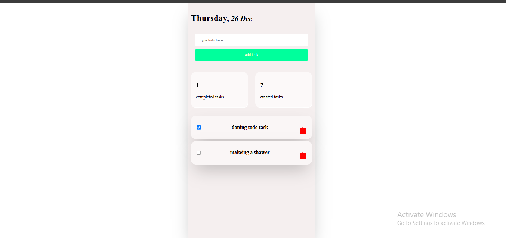

#  Calculator App


# To-Do App

A simple and easy-to-use To-Do application built with HTML, CSS, and JavaScript. This app allows users to add, edit, delete, and mark tasks as completed. It’s designed to help users stay organized and keep track of their daily tasks.

## Features:
- Add new tasks.
- Edit existing tasks.
- Mark tasks as completed.
- Delete tasks when done.
- Simple and user-friendly interface.
- Fully responsive design.

## Technologies Used:
- **React** .
- **css** for styling the app.
- **Typescript ** for functionality (adding, editing, deleting tasks).

## How to Use:
1. **Clone this repository**:
   ```bash
   git clone https://github.com/your-username/todo-app.git
